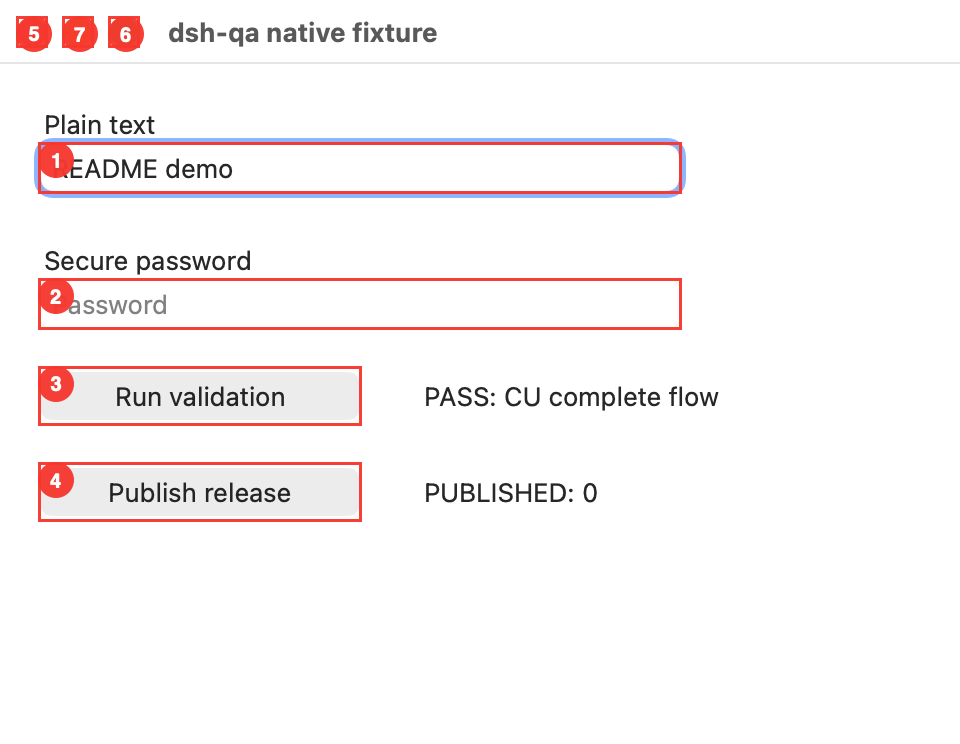

<h1 align="center">DSH Computer</h1>

<p align="center">
  <strong>A headless-first macOS Computer Use driver that refuses to act on yesterday's screen.</strong><br />
  <sub>Bounded Accessibility observation &bull; Native window vision + Set-of-Mark &bull; Expiring opaque refs &bull; Host-owned approval &bull; Action receipts</sub>
</p>

<p align="center">
  <sub>Package: <code>@zseven-w/dsh-computer</code> &middot; Local candidate: <code>0.1.0-rc.1</code> &middot; Runtime: macOS + Node.js <code>&gt;=24.11.0</code></sub>
</p>

<p align="center">
  <a href="./README.md"><b>English</b></a> &middot; <a href="./README.zh.md">简体中文</a>
</p>

<p align="center">
  <a href="#tools">Capabilities</a> &middot; <a href="#quick-start-local-candidate">Quick start</a> &middot; <a href="#safety-and-outcome-semantics">Safety</a> &middot; <a href="#develop-and-verify">Development</a> &middot; <a href="#documentation">Documentation</a>
</p>

<p align="center">
  
</p>
<p align="center"><sub>Real native fixture, captured by the Computer driver in light mode. Numbered marks come from visual observation. Text entry and AX click were executed; a fresh observation verified PASS after an unknown click receipt. No release was published.</sub></p>

## Why another Computer Use driver?

Seeing a button once is not authority to click it later. Windows move, applications restart, PIDs are reused, dynamic UIs rebind children, and another Agent can be operating at the same time. DSH Computer treats every observation as a short-lived capability rather than a bag of coordinates.

```text
computer_observe
  explicit/frontmost app + explicit/focused window
  bundle id + PID + launch identity
  window number (or composite identity)
  role + name + identifier + frame
           │
           ▼ observation + opaque refs, scoped to one live Agent, expires in <= 30s
       ┌──────────────────────────────┴──────────────────────────────┐
       ▼                                                             ▼
computer_visual_observe                                      computer_act
  exact numbered window                                       resolve one ref
  native PNG + pixel validation                               re-observe identity
  AX Set-of-Mark overlay                                      ask once if policy requires
  DSH image attachment                                        perform one action
       │                                                             │
       ▼                                                             ▼
current image-capable model receives the attachment        confirmed | unknown | rejected | failed
```

Visual observation and action share the same observation mutex. A visual read never consumes refs, while an accepted or potentially executed mutation consumes the whole observation.

```text
computer_act
  resolve the ref only inside that Agent scope
  re-observe app/process/window/target
  reject stale, rebound, or secure targets
  ask the owning user once for deterministic high-risk targets
  perform one bound action
           │
           ▼
receipt: confirmed | unknown | rejected | failed
  + post-action observation when available
```

The first vertical slice deliberately has no settings page. It exposes five headless tools and a reusable Cordis driver service for `dsh-qa`.

## Tools

| Tool | Contract |
| --- | --- |
| `computer_observe` | Bounded Accessibility tree for one macOS app/window. Returns opaque refs, a fingerprint, and an expiry. |
| `computer_visual_observe` | Captures only the numbered window bound to a fresh observation, validates its pixels, burns bounded AX Set-of-Mark labels into the image, and delivers it through DSH attachments to the exact current image-capable model. |
| `computer_visual_act` | Performs a `click`, `drag`, or `scroll` at attachment-image pixels from that exact capture after a host-owned approval. The tool converts model-visible attachment pixels to native capture pixels from trusted stored metadata; it never accepts a model scale or native coordinate. |
| `computer_act` | Safe `click`, `focus`, `type`, `key`, or `scroll` against one fresh ref. Re-observes identity before every action; `scroll` moves the containing AX scroll area and reports `unknown` until re-observation proves the content moved. |
| `computer_evidence` | Interactive-session, Accessibility, and Screen Recording readiness; Helper executable/bundle/signing/process/caller/resolution identity; and recent AX/visual action receipts for the current Agent only. |

Model arguments never contain an Agent id, an AX path, a PID lease, or a caller-supplied `sensitive` flag. The host supplies the live Agent identity; raw AX locators stay inside the driver.

`computer_visual_observe` accepts only `observation_id` and an optional `max_marks` (1–200, default 80). It accepts no path, app, window, coordinate, action ref, or approval input. The exact request-header provider/model route is checked before any screenshot; a missing attachment/LLM service, unknown route, or text-only model fails clearly without affecting `computer_observe`. The returned JSON contains durable attachment metadata, native/attachment dimensions and scale, and number → opaque-ref/source-index mappings—never a path, base64 payload, or screenshot byte buffer. DSH may normalize or downscale the stored image, but the numbered labels are already baked into it.

`computer_visual_act` accepts `op`, `observation_id`, `capture_sha256`, `point`, and for `op=drag` a `to`, or for `op=scroll` `direction`/`amount`. The `point`/`to` values are pixels in the delivered attachment image the model saw. The tool maps them to native capture pixels using only the trusted attachment geometry stored by `computer_visual_observe`; no caller-provided scale or native coordinate is accepted. It never takes an app, window, path, ref, approval, Agent id, or image understanding result from model arguments. Every visual action is an AX-opaque unknown target, so it always requires host approval, is re-validated/re-captured before and after approval, and returns `unknown` after dispatch — never `confirmed`, and never safe to retry blindly.

## Safety and outcome semantics

- Observations are scoped to `exec.agent.id`; agentless tool calls are rejected.
- A locked, login-window, non-console, or indeterminate desktop session fails closed before observation, capture, or action; the Helper never wakes, unlocks, or activates an app.
- Refs are random, opaque, retained only in memory, and expire after 1–30 seconds.
- An observation is single-mutation: after any accepted or potentially executed action, every ref from that observation is invalidated and the Agent must observe again.
- Action preflight compares exact bundle id, PID, launch identity, window identity, role/subrole, name, identifier, frame, and secure role.
- Clicks whose live AX name/identifier semantics match destructive, financial, send, publish, or share operations; `Return`/`Enter` commit keys; and key chords outside the explicit navigation allowlist require an informed, host-owned `allowed-once` decision. Safe focus/navigation actions do not prompt. The model cannot supply or forge an approval argument.
- Approval is bound to the live Agent/tool call plus the observation fingerprint, action digest, risk category, opaque ref digest, and a one-request nonce. The driver re-observes before asking and again after approval; a changed/expired/disposed target consumes the decision without dispatching the action.
- Every visual point action is treated as an AX-opaque unknown target: it always requires one host-owned `allowed-once` decision, and the driver re-observes/re-captures the exact bound window before asking and again immediately before dispatch. Secure fields discovered under the point or a drag endpoint are hard-denied.
- Secure text entry remains permanently denied and cannot be approved.
- A successful input dispatch is not automatically a successful user outcome. `unknown` is returned when the helper cannot prove the visible effect.
- A click is confirmed only when the same revalidated target exposes an action-specific value transition. A missing, replaced, moved, or merely focused target remains `unknown`.
- If transport is lost after an action may have reached the helper, the receipt is `unknown`, never falsely `failed` and therefore never safe to retry blindly.
- Every native request is cancellable. Per-Agent processes and observations are cleared on scope/plugin disposal.
- Agents waiting on the same first-use Swift build cancel independently; one Agent cannot kill another Agent's build wait. The shared compiler process is terminated only when the last waiter leaves or the plugin is disposed.
- The declared `global-hook` capability is used only to observe `agent/disposed` and tear down that Agent's state; this plugin does not read or rewrite Agent messages.

### Trusted-host boundary

The short-lived Helper uses an ordinary stdin/stdout JSON protocol. Its native approval grant checks are defense in depth inside a trusted, same-user DSH host → plugin → Helper chain; they do not cryptographically authenticate the caller. Public distribution must add authenticated IPC/XPC or an equivalent signed-host requirement before treating the Helper as a security boundary against another process running as the same macOS user.

## Driver contract for dsh-qa

The plugin provides the Cordis service `zsevenComputerDriver` and exports its structural TypeScript contract:

```ts
import {
  COMPUTER_DRIVER_SERVICE,
  type ComputerDriver,
  type ComputerActionReceipt,
} from '@zseven-w/dsh-computer/driver'

ctx.inject([COMPUTER_DRIVER_SERVICE], (driverCtx) => {
  const driver = driverCtx[COMPUTER_DRIVER_SERVICE] as ComputerDriver
  // scopeId must come from the trusted live Agent/session, not model input.
})
```

`contractVersion` is currently `5`. v3 added the `scroll` action; v4 made evidence honest about truncation (`computer_evidence` now carries `receipts_total`/`receipts_dropped`/`receipts_returned`/`bounded`), made observation eviction TTL-first rather than count-based, and reports every unmarked Set-of-Mark target in `omitted` with a reason from a closed vocabulary. v5 adds the coordinate-based `computer_visual_act` fallback for AX-opaque custom views: `computer_visual_observe` persists a capture binding keyed by the delivered PNG SHA-256, the DSH tool converts attachment pixels to native capture pixels using trusted stored metadata, and the driver re-captures/re-validates the exact window before and after a required host approval before dispatching `click`/`drag`/`scroll`. Visual dispatch receipts are `unknown`, never `confirmed`; the consumer re-observes to decide the effect and must not retry an `unknown` blindly. Evidence now returns the typed AX/visual receipt union from the same bounded ring, so visual actions are not hidden from `computer_evidence`. Omitted-reason vocabulary: `mark-budget-exceeded`, `static-label`, `target_has_no_frame`, `target_outside_captured_window`, `stale_target: …`. Consumers must branch on that value before relying on later fields.

Observation retention is also byte-budgeted per Agent scope (32 MiB of serialized payload): when a new observation would exceed the budget, the oldest TTL-valid observations are evicted first — still reported as `OBSERVATION_EVICTED` — and the most recent observation is never evicted.

## Quick start (local candidate)

The source package declares `0.1.0-rc.1`; this guide uses a local candidate, not a verified npm release. No step below installs an app into `/Applications`.

Requirements: macOS, Node.js `>=24.11.0`, pnpm `10.34.5`, and a Swift toolchain for the native Helper. Install DSH separately:

```sh
npm install -g @deepseek-ai/dsh@latest
```

Run the following from this repository, replacing the absolute path with your checkout:

```sh
pnpm install
pnpm build
dsh plugin --profile web add link:/absolute/path/to/dsh-computer
dsh web
```

The Swift helper source ships with the plugin. Runtime resolution is deliberately ordered as: an explicit `DSHPLUGIN_COMPUTER_HELPER` override, the fixed local app below, then development builds staged into a content-addressed cache and ad-hoc re-signed with a fixed development code identifier. SwiftPM worktree artifacts are never executed in place. Explicit overrides and development builds are reported as `identityStable: false`.

For a stable local TCC identity, choose the signing identity yourself and run the installer explicitly:

```sh
security find-identity -v -p codesigning
pnpm run helper:install-local -- --identity "<exact certificate name or SHA-1>"
```

It assembles and verifies `~/Library/Application Support/ZSeven/DSH Computer/DSH Computer Helper.app` with bundle id `io.github.zseven-w.dsh-computer.helper`. Nothing in install, activation, build, test, pack, or publish runs this script automatically. It never chooses a certificate, opens System Settings, or requests Accessibility/Screen Recording permission; the npm archive contains the script and Swift source, never the machine-signed `.app`.

Before observing UI, macOS must expose an unlocked interactive console session and grant Accessibility to **DSH Computer Helper at the exact reported path**. Screen capture separately requires Screen Recording for the same Helper. `computer_evidence` reports session availability/known lock state, both TCC preflight booleans, the actual executable/bundle/signing identity, Helper PID/PPID, and its immediate DSH/Node caller context. Status uses prompt-free APIs and never opens a permission prompt. A false `interactiveSessionAvailable` can also mean the session signals were indeterminate; a TCC boolean cannot distinguish “denied” from “not determined.”

## Develop and verify

```sh
pnpm install
pnpm run typecheck
pnpm test
pnpm build
pnpm run smoke:pack
```

Acceptance includes Node unit tests, Swift pure-policy/identity tests, a real Swift helper build and protocol status handshake, and `npm pack` → clean `npm install`. On macOS the clean install lazily builds its own packed Helper, runs status plus a bounded observation (never an action), and then reaches quiescence. The smoke also asserts that no `@deepseek-ai/*` package is pulled into `node_modules`.

## Current limits

- macOS only. The package still installs elsewhere so a DSH profile can explain the unsupported platform instead of failing activation; native actions remain unavailable.
- The current desktop must be unlocked and interactively available. Lock transitions are checked before and after read paths and immediately before mutation; background automation while the login window owns the session is rejected.
- AX refs are the primary action path. For AX-opaque views, `computer_visual_act` provides capture-bound coordinate `click`, `drag`, and `scroll` after host approval; dispatch remains `unknown` until a consumer verifies the outcome. AX `scroll` adjusts the containing scroll area's vertical scroll bar. There is no built-in OCR, clipboard automation, or full IME simulation.
- Visual observation requires an exact AX window number/frame, Screen Recording permission for the reported Helper identity, a mounted DSH attachment store, and an exact current model route that explicitly declares image input. Near-black/transparent captures fail pixel validation; near-white/near-uniform captures are retained with their warning classification.
- `type` uses a settable Accessibility value; it is not a general replacement for natural keyboard/IME input.
- Some applications expose incomplete AX names, identifiers, frames, window numbers, or actions. Missing strong launch identity makes action preflight fail closed.
- Deterministic risk classification can only use the AX semantics an app exposes. An unlabeled custom control cannot be proven destructive from AX alone; use visual observation for context and treat this as a current safety limit, not a guarantee.
- The npm candidate does not ship a prebuilt or machine-signed Helper. The explicit local installer can create a certificate-signed stable identity on one development machine; public distribution still requires a Developer ID Application build, Hardened Runtime, timestamp, notarization, stapling, and acceptance from the real tarball.
- Local gates cover policy, identity, packaging, and the native protocol. A [CI workflow](./.github/workflows/ci.yml) and [Helper release pipeline](./RELEASE.md) are checked in; their presence is not proof of a successful CI run or a signed, notarized release. Individual action tests do not establish broad coverage of long-running workflows, multiple displays, Spaces/Stage Manager, focus contention, or Chinese IME.

## Documentation

- [中文说明](./README.zh.md) — the same installation, capability, and safety boundaries in Chinese.
- [Native Helper release guide](./RELEASE.md) — signing, notarization, packaging, and explicit owner setup.
- [Driver contract](./src/contracts.ts) — versioned types for `dsh-qa` consumers.
- [CI workflow](./.github/workflows/ci.yml) — configured build and verification matrix, not a release claim.

## License

[MIT](./LICENSE)
